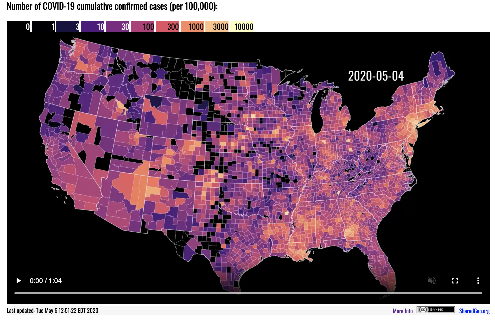

<!-- 

What follows are some tweaks to the CSS that control how the html page will appear. You don't have to learn much CSS to understand enough to modify the template. 

-->


<style>

/* This is a link to a logo image */

#TOC {
  background: url("https://www.dropbox.com/s/a6552qj6irhlfcb/dghi.png?dl=1");
  background-size: contain;
  padding-top: 75px !important;
  background-repeat: no-repeat;
  border: 0;
  color: #808080; 
  }

/* controls TOC background */
.list-group-item.active, .list-group-item.active:focus, .list-group-item.active:hover {
  background-color: #00539b;
}
</style>
  
  
<style type="text/css">

/* These are links to Google fonts */
@import url('https://fonts.googleapis.com/css?family=Libre+Franklin:200,300,400,500,700');
@import url('https://fonts.googleapis.com/css?family=Source+Sans+Pro:200,300,400,500,700');
@import url('https://fonts.googleapis.com/css?family=Anonymous+Pro:400');
  
/* This defines the type of font for the body text */
body{ /* Normal  */
  font-size: 20px;
  font-family: 'Libre Franklin', sans-serif;
  font-weight:200;
}

/* These add some white space when inserting figures/tables */

.figure {
  margin-top: 50px;
  margin-bottom: 50px;
}

table {
  margin-top: 50px;
  margin-bottom: 50px !important;
}

/* These control how the title/subtitle will appear */

h1.title {
  font-size: 80px;
  color: #00539b;
  font-family: 'Source Sans Pro', sans-serif;
  font-weight:700;
}

h3.subtitle {
  font-size: 40px;
  color: #A9A9A9;
  font-family: 'Source Sans Pro', sans-serif;
  font-weight:800;
  font-style: normal; 
}

em {
  font-style: normal;
}

/* These control how levels of headings will appear */

h1 {
  font-size: 40px;
  color: #00539b;
  font-family: 'Source Sans Pro', sans-serif;
  font-weight:700;
  margin-top: 50px;
}

h2 {
  font-size: 30px;
  color: #E89923;
  font-family: 'Source Sans Pro', sans-serif;
  font-weight:500;
}

/* These control how code chunks will appear */

td {
   font-size: 15px;
   font-family: 'Anonymous Pro';
}

code.r {
  font-size: 15px;
  font-family: 'Anonymous Pro';
}

pre {
  font-size: 15px;
  font-family: 'Anonymous Pro';
  margin-top: 50px;
  margin-bottom: 50px !important;
}

/* MISC / I forget */

div.main-container {
  max-width: 1200px;
  text-align: justify;
  text-justify: inter-word;
}

p
{
  margin-left: 0.5em;
  margin-top: 0em;
  margin-bottom: 1.5em;
}

hl {
    background-color: #FFC20E;
}

in {
    color: #F37021;
}

/* unvisited link */
a:link {
    color: #4FBFA5;
}

/* visited link */
a:visited {
    color: #4FBFA5;
}

/* mouse over link */
a:hover {
    color: #4FBFA5;
}

/* selected link */
a:active {
    color: #4FBFA5;
}
</style>
  
<br>
<br>


<!-- The actual markdown starts here -->


# `sf` package

First we'll take the `{sf}` package for a spin to reproduce this figure from [SharedGeo](https://www.sharedgeo.org/COVID-19/).[^sharedgeo]

[^sharedgeo]: Or you could add this as a footnote. https://www.sharedgeo.org/COVID-19/

```{r goal, echo=FALSE}
  
```

## Set Up

Load the packages we'll need for today.

```{r packages, message=FALSE}
  library(tidyverse)
  #library(tidycensus)
  # https://api.census.gov/data/key_signup.html
  #census_api_key("YOUR KEY HERE")
  library(sf)
  library(viridis)
  library(gganimate)
  library(leaflet)
```

We have two data sources: county-level COVID-19 data from the NY Times and county population and geographic data from the U.S. Census Bureau.

```{r load}
  covid <- read.csv("https://raw.githubusercontent.com/nytimes/covid-19-data/master/us-counties.csv", 
                    stringsAsFactors = FALSE)
  
  # counties <- get_acs(geography = "county",
  #                     variables = "B01003_001",
  #                     geometry = TRUE) 
  # 
  # states <- get_acs(geography = "state",
  #                   variables = "B01003_001",
  #                   geometry = TRUE)
  
  load("../data/census.RData")
```

## Prep the Data

The original plot only shows the lower 48 states, so we have to exclude Alaska, Hawaii, DC, and Puerto Rico from the COVID data and from the boundary files. 

### COVID-19

```{r prep}
  covidPrepped <- 
  covid %>%
    filter(state!="District of Columbia" &
           state!="Puerto Rico" &
           state!="Hawaii" &
           state!="Alaska") %>%
    select(date, fips, cases, deaths) %>%
    mutate(date = lubridate::ymd(date)) %>%
    mutate(fips = stringr::str_pad(fips, width=5, pad="0")) 
```

### Population/Geographic

```{r geo}
  counties <- 
    counties %>%
    filter(!grepl("Hawaii", NAME)) %>%
    filter(!grepl("Puerto Rico", NAME)) %>%
    filter(!grepl("District of Columbia", NAME)) %>%
    filter(!grepl("Alaska", NAME)) 
  
  states <- 
  states %>%
    filter(NAME!="District of Columbia" &
           NAME!="Puerto Rico" &
           NAME!="Hawaii" &
           NAME!="Alaska")
```

### Join the COVID data to the counties

```{r join}
  joined <- 
  counties %>%
    left_join(covidPrepped, by = c("GEOID" = "fips"))
```

### Fill in for missing data

```{r complete}
  completed <- 
  joined %>%
    complete(GEOID, date, fill = list(cases = 0)) %>%
    select(GEOID, date, cases) 
```


### Rejoin

```{r rejoin}
  rejoined <- 
  completed %>%
    left_join(select(counties, GEOID, NAME, estimate, 
                     geometry),
              by = "GEOID") %>%
    st_as_sf()
```

### Construct

```{r construct}
  constructed <- 
  rejoined %>%
    mutate(casesPop = ifelse(is.na(cases), 0, cases)) %>%
    mutate(casesPop = (cases/estimate)*100000) %>%
    mutate(group = cut(casesPop, 
                       breaks = c(0, 1, 3, 10, 30, 100, 
                                  300, 1000, 3000, 10000, 
                                  Inf),
                       labels = c(0, 1, 3, 10, 30, 100, 
                                  300, 1000, 3000, 10000),
                       include.lowest = TRUE)
    ) %>%
    mutate(month = lubridate::month(date, 
                                    label=TRUE, 
                                    abbr=TRUE),
           day = lubridate::day(date),
           monthDay = paste(month, day, sep=" "),
           dayLabel = lubridate::wday(date)) %>%
    filter(dayLabel==3) %>%
    select(monthDay, GEOID, geometry, group)
```

## Plot static

```{r}
  ggplot(constructed %>% filter(monthDay=="May 5")) +
      geom_sf(aes(fill = group), color = "white", size=.1) +
      geom_sf(data=states, fill=NA, color="white", size=.3) +
      scale_fill_viridis_d(option = "magma", drop=FALSE) +
      labs(title = "Number of COVID-19 cumulative\nconfirmed cases (per 100,000):",
           subtitle = 'May 5, 2020',
           caption = "Data: NYTimes, https://github.com/nytimes/covid-19-data",
           x="",
           y="") +
      coord_sf(crs = "+proj=aea +lat_1=29.5 +lat_2=45.5 +lat_0=37.5 +lon_0=-96 +x_0=0 +y_0=0 +ellps=GRS80", 
               datum=NA) +
      theme_minimal() + 
      theme(panel.background = element_rect(fill = 'black'),
            plot.title.position = "plot",
            plot.title = element_text(size=20,
                                      face="bold"),
            plot.subtitle = element_text(size=15),
            plot.caption = element_text(size=10),
            legend.position = "top",
            legend.box = "horizontal",
            legend.title = element_blank(),
            legend.justification='left') +
      guides(fill = guide_legend(nrow = 1))
```

## Animate

```{r animate, eval=FALSE}
# get vector of unique monthDay
  monthDayLevels <- unique(constructed$monthDay)
    
  constructed <- 
  constructed %>%
    mutate(monthDay = factor(monthDay,
                             levels = monthDayLevels,
                             labels = monthDayLevels))
  
# plot
  ggplot(pData) +
      geom_sf(aes(fill = group), color = "white", size=.1) +
      geom_sf(data=states, fill=NA, color="white", size=.3) +
      scale_fill_viridis_d(option = "magma", drop=FALSE) +
      labs(title = "Number of COVID-19 cumulative\nconfirmed cases (per 100,000):",
           subtitle = '{closest_state}',
           caption = "Data: NYTimes, https://github.com/nytimes/covid-19-data",
           x="",
           y="") +
      coord_sf(crs = "+proj=aea +lat_1=29.5 +lat_2=45.5 +lat_0=37.5 +lon_0=-96 +x_0=0 +y_0=0 +ellps=GRS80", 
               datum=NA) +
      theme_minimal() + 
      theme(panel.background = element_rect(fill = 'black'),
            plot.title.position = "plot",
            plot.title = element_text(size=20,
                                      face="bold"),
            plot.subtitle = element_text(size=15),
            plot.caption = element_text(size=10),
            legend.position = "top",
            legend.box = "horizontal",
            legend.title = element_blank(),
            legend.justification='left') +
      guides(fill = guide_legend(nrow = 1)) +
      transition_states(monthDay,
                        transition_length = 4,
                        state_length = 1) +
      ease_aes('cubic-in-out') 
```

# `{leaflet}`

[`{leaflet}`](https://rstudio.github.io/leaflet/) is a simple to use yet powerful library for creating interactive maps. We're going to finish with a simple example that uses `{leaflet}` to overlay our `sf` object on an interactive map.

```{r leaf, warning=FALSE, message=FALSE}
  nc <- constructed %>%
    filter(monthDay=="May 5") %>%
    filter(substring(GEOID, 1, 2)=="37") %>%
    mutate(group = as.numeric(as.character(as.factor(group))))
  
  bins <- c(0, 1, 3, 10, 30, 100, 
            300, 1000, 3000, 10000, Inf)
  pal <- colorBin("YlOrRd", domain = nc$group, bins = bins)
  
  nc %>%
    leaflet() %>% 
    setView(lng = -78.8986, lat = 35.9940, zoom = 6) %>%
    
  # run chunk and then try another tile set
    addTiles() %>%
    #addProviderTiles(providers$Stamen.Toner) %>%
    #addProviderTiles(providers$CartoDB.Positron) %>%
    
    addPolygons(fillColor = ~pal(group),
                weight = .5,
                opacity = .7,
                color = "white") %>%
    addLegend(pal = pal, 
              values = ~group, 
              opacity = 0.7, 
              title = NULL,
              position = "bottomright")
```
