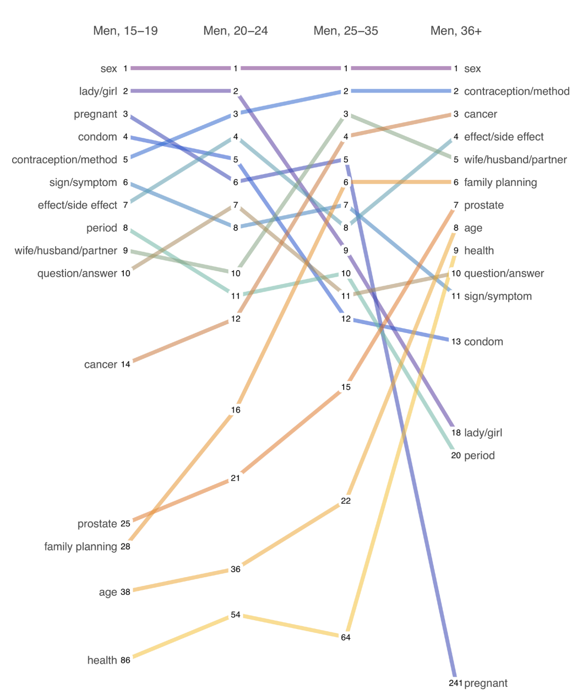
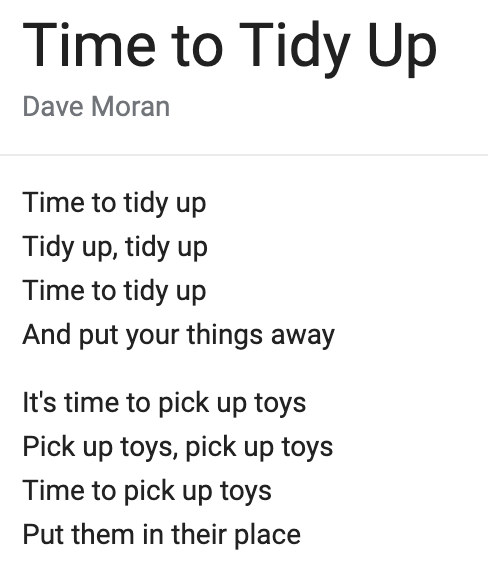
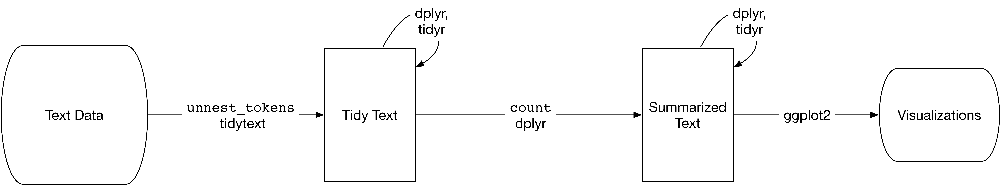
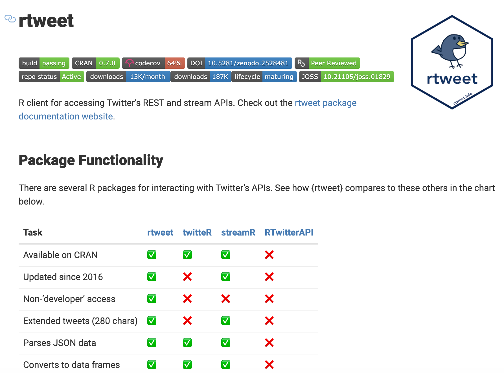

<!-- 

What follows are some tweaks to the CSS that control how the html page will appear. You don't have to learn much CSS to understand enough to modify the template. 

-->


<style>

/* This is a link to a logo image */

#TOC {
  background: url("https://www.dropbox.com/s/a6552qj6irhlfcb/dghi.png?dl=1");
  background-size: contain;
  padding-top: 75px !important;
  background-repeat: no-repeat;
  border: 0;
  color: #808080; 
  }

/* controls TOC background */
.list-group-item.active, .list-group-item.active:focus, .list-group-item.active:hover {
  background-color: #00539b;
}
</style>
  
  
<style type="text/css">

/* These are links to Google fonts */
@import url('https://fonts.googleapis.com/css?family=Libre+Franklin:200,300,400,500,700');
@import url('https://fonts.googleapis.com/css?family=Source+Sans+Pro:200,300,400,500,700');
@import url('https://fonts.googleapis.com/css?family=Anonymous+Pro:400');
  
/* This defines the type of font for the body text */
body{ /* Normal  */
  font-size: 20px;
  font-family: 'Libre Franklin', sans-serif;
  font-weight:200;
}

/* These add some white space when inserting figures/tables */

.figure {
  margin-top: 50px;
  margin-bottom: 50px;
}

table {
  margin-top: 50px;
  margin-bottom: 50px !important;
}

/* These control how the title/subtitle will appear */

h1.title {
  font-size: 80px;
  color: #00539b;
  font-family: 'Source Sans Pro', sans-serif;
  font-weight:700;
}

h3.subtitle {
  font-size: 40px;
  color: #A9A9A9;
  font-family: 'Source Sans Pro', sans-serif;
  font-weight:800;
  font-style: normal; 
}

em {
  font-style: normal;
}

/* These control how levels of headings will appear */

h1 {
  font-size: 40px;
  color: #00539b;
  font-family: 'Source Sans Pro', sans-serif;
  font-weight:700;
  margin-top: 50px;
}

h2 {
  font-size: 30px;
  color: #E89923;
  font-family: 'Source Sans Pro', sans-serif;
  font-weight:500;
}

/* These control how code chunks will appear */

td {
   font-size: 15px;
   font-family: 'Anonymous Pro';
}

code.r {
  font-size: 15px;
  font-family: 'Anonymous Pro';
}

pre {
  font-size: 15px;
  font-family: 'Anonymous Pro';
  margin-top: 50px;
  margin-bottom: 50px !important;
}

/* MISC / I forget */

div.main-container {
  max-width: 1200px;
  text-align: justify;
  text-justify: inter-word;
}

p
{
  margin-left: 0.5em;
  margin-top: 0em;
  margin-bottom: 1.5em;
}

hl {
    background-color: #FFC20E;
}

in {
    color: #F37021;
}

/* unvisited link */
a:link {
    color: #4FBFA5;
}

/* visited link */
a:visited {
    color: #4FBFA5;
}

/* mouse over link */
a:hover {
    color: #4FBFA5;
}

/* selected link */
a:active {
    color: #4FBFA5;
}
</style>
  
<br>
<br>


<!-- The actual markdown starts here -->

# Introduction

We're in the age of big data, and text mining has never been more popular or easier to do, especially in R. Whether you are a qualitative researcher looking to automate more of your workflow or a quant seeking to pull insights from a corpus of messages, text mining is a skill you need.

My first experience with text mining was in graduate school, probably around 2006. A friend wrote me a PERL script to pull all of the wires from *LexisNexis* mentioning the Lord's Resistance Army going back 20 years. Wires have a standard format, so we were able to extract the date, location, and casualty figures for each attack. I had to do a lot of manual clean-up, but it was magic. 

```{r names, fig.cap="Graduate school me worked in SPSS and named files like an animal.", echo=FALSE}
  knitr::include_graphics("../../img/shittyfiles.png")
```

Fast forward about a decade and I returned to text mining in my work with Nivi. I was sitting on a corpus of nearly 180,000 text messages, and I needed a way to analyze them automatically. Fortunately for me, Julia Silge and David Robinson wrote a book and package called [`{tidytext}`](https://www.tidytextmining.com/) and gave both away for free. My colleagues and I [published a paper](https://gatesopenresearch.org/articles/3-1475) with an accompanying tutorial on how to use the package. We found astonishing results about what men of all age groups want to discuss. 

```{r slope, fig.cap="Slope chart showing the most frequently used words by men, disaggregated by age group. Source: [Green et al., 2019](https://gatesopenresearch.org/articles/3-1475).", echo=FALSE}
  
```

# The `{tidytext}` package

```{r packages, echo=FALSE, message=FALSE}
  library(tidytext)
  library(tidyverse)
  options(scipen=999)
```


This package makes working with text data a breeze. It follows Wickham's priciples of tidy data we reviewed earlier in this workshop series:

* Each variable is a column
* Each observation is a row
* Each type of observational unit is a table

The "tidy" in `{tidytext}` is defined as a table with one-token-per-row, where "token" means a unit of text for analysis, like a word. Take the song, "Time to Tidy Up", by Dave Moran:

```{r tidyup, fig.cap="[Time to Tidy Up](https://www.lyrics.com/lyric/11841616/Dave+Moran/Time+to+Tidy+Up), by Dave Moran.", echo=FALSE}
  
```

We can use the `unnest_tokens()` function to tokenize these song lyrics into individual words and organize into a tidy data format.

```{r unnest, echo=FALSE}
  example <- tibble(song = "Time to Tidy Up",
                        lyrics = "Time to tidy up, Tidy up, tidy up, Time to tidy up, And put your things away, It's time to pick up toys, Pick up toys, pick up toys, Time to pick up toys, Put them in their place")

  example %>%
    unnest_tokens(word, lyrics) %>%
    slice(1:17) %>%
    knitr::kable(caption = "A tidy tokenized version of Time to Tidy Up.")
```

`unnest_tokens()` made our job easy by removing punctuation and converting all text to lowercase by default. Now we can get on with summarizing and visualizing the data.

```{r flow, fig.cap="Text analysis flow diagram. Source: [Silge and Robinson (2020)](https://www.tidytextmining.com/tidytext.html).", echo=FALSE}
  
```

# Data for today

The data for today's tutorial come from the President's Twitter timeline.

<blockquote class="twitter-tweet"><p lang="en" dir="ltr">The Coronavirus is very much under control in the USA. We are in contact with everyone and all relevant countries. CDC &amp; World Health have been working hard and very smart. Stock Market starting to look very good to me!</p>&mdash; Donald J. Trump (@realDonaldTrump) <a href="https://twitter.com/realDonaldTrump/status/1232058127740174339?ref_src=twsrc%5Etfw">February 24, 2020</a></blockquote> <script async src="https://platform.twitter.com/widgets.js" charset="utf-8"></script>

<br>

There are several good packages for working with Twitter data in R. The most feature-packed package is probably [`{rtweet}`](https://rtweet.info/).

```{r rtweet, fig.cap="Package comparisons. Source: [`{rtweet}` package](https://rtweet.info/).", echo=FALSE}
  
```

We won't use any of these packages today because Twitter requires you to create a free developer account to access the API. The process is not hard, it just takes more time than we have. You can follow [the steps outlined here](https://cran.r-project.org/web/packages/rtweet/vignettes/auth.html) if you want to explore the Twitterverse with the tidyverse.

To speed things up, I prepared a csv file with all of the President's tweets since December 10, 2019 when one of the first cases of COVID-19 in Wuhan, China started experiencing symptoms. Import this file and assign to the object `stableGenius`.

```{r import, message=FALSE, echo=FALSE}
  stableGenius <- read_csv("../data/textmining.csv")
  stableGenius %>%
    select(text, created_at, favorite_count) %>%
    slice(1:10) %>%
    knitr::kable(caption = "Dataframe of the President's tweets since December 10, 2019.")
  
```

# Quick exploration

We can start by counting the number of tweets by date and plotting.

```{r day, echo=FALSE}
  p <- stableGenius %>%
    mutate(created_at = lubridate::mdy_hm(created_at),
           created_at = lubridate::date(created_at)) %>%
    group_by(created_at) %>%
    count(name="tweets") %>%
    ungroup() %>%
    complete(created_at, fill=list(tweets=0)) %>%
    ggplot(aes(x=created_at, y=tweets)) +
      labs(x="", 
           y="",
           title="Tweets published each day by @realdonaldtrump account",
           subtitle="December 10, 2019 until 5pm ET May 21, 2020.",
           caption="Source: Twitter.") +
      theme_minimal() +
      theme(plot.title.position = "plot",
            plot.title = element_text(face="bold"))
      
  p + geom_col(fill="#ff8a00") 
  p + geom_line(color="#ff8a00") 
```

The daily sum is a bit noisy, so let's try aggregating by week using `lubridate::floor_date()` and `group_by()`.

```{r week, echo=FALSE}
  p <- stableGenius %>%
    mutate(created_at = lubridate::mdy_hm(created_at),
           created_at = lubridate::date(created_at),
           week = lubridate::floor_date(created_at,
                                        unit="week")) %>%
    group_by(week) %>%
    count(name="tweets") %>%
    ungroup() %>%
    ggplot(aes(x=week, y=tweets)) +
      labs(x="", 
           y="",
           title="Tweets published each week by @realdonaldtrump account",
           subtitle="December 10, 2019 until 5pm ET May 21, 2020.",
           caption="Source: Twitter.") +
      theme_minimal() +
      theme(plot.title.position = "plot",
            plot.title = element_text(face="bold"))
      
  p + geom_col(fill="#ff8a00") 
  p + geom_line(color="#ff8a00")
```

# Label COVID-19

The President tweets a lot, but how much of his timeline is COVID-19 related? With *only* `r nrow(stableGenius)` tweets in our dataset, it would be reasonable to manually (qualitatively) "code" or label each tweet if we wanted to answer this question as part of a study. If there were 10x as many tweets, we might opt to manually label a few hundred and use this training dataset to build a machine learning classification model that predicts whether each tweet should be labeled as COVID-19 related or not.

Our ambitions this week are more modest, however, so we'll simply identify a group of keywords the President tends to use in his COVID-19 messages and flag tweets that contain any of the keywords. It's not perfect, but that's OK because we're just exploring. Don't call CNN.

```{r covid, echo=FALSE}
  keywords <- c("covid|virus|coronavirus|corona|
                corona virus|testing|tests|masks,
                reopen|world health organization,
                cases|deaths|study|studies,
                treatment|cure|pandemic|cares,
                ventilator|flu|infection|distancing,
                task force|open|hydroxychloroquine|
                bleach|lockdown|deaths|died")

  stableGenius_cov <- stableGenius %>%
    mutate(text = tolower(text)) %>%
    mutate(covid = ifelse(grepl(keywords, text), "yes", "no"),
           covid = factor(covid))
  
  stableGenius_cov %>%
    group_by(covid) %>%
    count() %>%
    knitr::kable()
```

To plot the relative make-up of the President's tweets, we first need to count tweets by week and covid label. This gives a long(er) dataframe that we can pass to `ggplot()` along with `fill=covid`.

```{r relative, echo=FALSE}
  stableGenius_cov %>%
    mutate(created_at = lubridate::mdy_hm(created_at),
           created_at = lubridate::date(created_at),
           week = lubridate::floor_date(created_at,
                                        unit="week")) %>%
    group_by(week, covid, .drop = FALSE) %>%
    count(name="tweets") %>%
    ungroup() %>%
    ggplot(aes(x=week, y=tweets, fill=covid)) +
      geom_col(position = "stack") + #position = "dodge"
      scale_fill_manual(values=c("grey", "#ff8a00")) +
      labs(x="", 
           y="",
           title="COVID-19 never dominates @realdonaldtrump's Twitter timeline",
           subtitle="December 10, 2019 until 5pm ET May 21, 2020.",
           caption="Source: Twitter.") +
      theme_minimal() +
      theme(plot.title.position = "plot",
            plot.title = element_text(face="bold"))
```

The overall number of tweets (aka, the denominator) varies by week, so we could take this one step further and calculate/plot the percentage of tweets that are related to COVID-19.

```{r percentage, echo=FALSE}
  stableGenius_cov %>%
    mutate(created_at = lubridate::mdy_hm(created_at),
           created_at = lubridate::date(created_at),
           week = lubridate::floor_date(created_at,
                                        unit="week")) %>%
    group_by(week, covid, .drop = FALSE) %>%
    count(name="tweets") %>%
    group_by(week) %>%
    mutate(covidP = (tweets/sum(tweets))*100) %>%
    ungroup() %>%
    filter(covid=="yes") %>%
    ggplot(aes(x=week, y=covidP)) +
      geom_line(color="#ff8a00") +
      labs(x="", 
           y="",
           title="COVID-19 never dominates @realdonaldtrump's Twitter timeline",
           subtitle="December 10, 2019 until 5pm ET May 21, 2020.",
           caption="Source: Twitter.") +
      theme_minimal() +
      theme(plot.title.position = "plot",
            plot.title = element_text(face="bold")) #+ ylim(0,100)
```

# Time to tokenize

To explore the data in a tidy text way, we need to tokenize into a 1-word-per-row format using `unnest_tokens()`. Before we get to this step, however, we need to remove all of the URLs in the President's tweets. We'll do this by setting a regular expressions (regex) pattern for URLs and using `str_remove_all()` to remove this pattern from the tweets. 

How did I create this regex string? Like everyone else—I googled something. Only 3-5 people in the world know how to do this, so you have to ask them on Stack Overflow or find an existing answer. If you want to be one of the chosen few, start [here](https://stringr.tidyverse.org/articles/regular-expressions.html), read [this chapter](https://r4ds.had.co.nz/strings.html), and download [this cheatsheet](https://github.com/rstudio/cheatsheets/raw/master/regex.pdf).

```{r tokenizeTrump, echo=FALSE}
# regex to identify URLs
  url_regex <- "http[s]?://(?:[a-zA-Z]|[0-9]|[$-_@.&+]|[!*\\(\\),]|(?:%[0-9a-fA-F][0-9a-fA-F]))+"

  token <- stableGenius_cov %>%
    mutate(text = str_remove_all(text, 
                                 url_regex)) %>% # remove URLs
    mutate(created_at = lubridate::mdy_hm(created_at)) %>%
    filter(covid=="yes") %>%
    select(created_at, text) %>%
    unnest_tokens(word, text)

  token %>%
    slice(1:15) %>%
    knitr::kable()
```

As you can see from this table, our tokens include common words like "the" and "to". These words are not informative in an analysis, so we'll remove them with `anti_join()`. This is a filtering join:

> return all rows from x where there are not matching values in y, keeping just columns from x.

```{r removeStop, message=FALSE, echo=FALSE}
# check to make sure no keywords in stop_words
  keywords %in% stop_words

# remove stop_words
  token_noStop <- token %>%
    anti_join(stop_words)

  token_noStop %>%
    count(word, sort = TRUE) %>%
    slice(1:15) %>%
    knitr::kable()
```

"amp" is a weird result, so let's have a look at tweets that contain "amp".

```{r amp, echo=FALSE}
  stableGenius_cov %>%
    filter(covid=="yes") %>%
    filter(grepl("amp", text)) %>%
    select(text) %>%
    slice(1:10) %>%
    knitr::kable()
```

We can take the additional step of filtering "amp" out of our tokenized dataframe.

```{r removeAmp, echo=FALSE}
  token_noStop <- token_noStop %>%
    filter(word!="amp")
```

Let's count the frequency of each word and plot.

```{r freq, echo=FALSE}
  token_noStop %>%
    count(word, sort = TRUE) %>%
    filter(n > 20) %>%
    mutate(word = reorder(word, n)) %>%
    ggplot(aes(word, n)) +
      geom_col(fill="#ff8a00") +
      coord_flip() + 
      labs(x="", 
           y="",
           title="@realdonaldtrump's most frequently tweeted words",
           subtitle="COVID-19 related tweets from December 10, 2019 until 5pm ET May 21, 2020.",
           caption="Source: Twitter.") +
      theme_minimal() +
      theme(plot.title.position = "plot",
            plot.title = element_text(face="bold"))
```

# Sentiment

In addition to summarizing the frequency of words, we can also analyze the sentiment of the tweets. A simple approach is to analyze sentiment at the word level and summarize across words in a collection.

[`{tidytext}`](https://www.tidytextmining.com/sentiment.html) has three built in sentiment lexicons: `AFINN`, `bing`, and `nrc`.

> All three of these lexicons are based on unigrams, i.e., single words. These lexicons contain many English words and the words are assigned scores for positive/negative sentiment, and also possibly emotions like joy, anger, sadness, and so forth. The nrc lexicon categorizes words in a binary fashion (“yes”/“no”) into categories of positive, negative, anger, anticipation, disgust, fear, joy, sadness, surprise, and trust. The bing lexicon categorizes words in a binary fashion into positive and negative categories. The AFINN lexicon assigns words with a score that runs between -5 and 5, with negative scores indicating negative sentiment and positive scores indicating positive sentiment.

```{r lexicon, message=FALSE, echo=FALSE}
  # install.packages("textdata")
  afinn <- get_sentiments("afinn")
  bing <- get_sentiments("bing")
  nrc <- get_sentiments("nrc")
  
  afinn %>% 
    rename("afinn" = "value") %>%
    inner_join(bing %>% rename("bing" = "sentiment")) %>%
    inner_join(nrc %>% rename("nrc" = "sentiment"), 
               by="word") %>%
    slice(1:10) %>%
    knitr::kable()
```

For instance, we can look for words in the President's tweets that are labeled as "anger" in the `nrc` lexicon. We'll do this with `inner_join`, a mutating join:

> return all rows from x where there are matching values in y, and all columns from x and y. If there are multiple matches between x and y, all combination of the matches are returned.

```{r anger, message=FALSE, echo=FALSE}
  nrc_anger <- get_sentiments("nrc") %>% 
    filter(sentiment == "anger")

  token_noStop %>%
    inner_join(nrc_anger) %>%
    count(word, sort = TRUE) %>%
    slice(1:10) %>%
    knitr::kable()
```

Let's go back to the President's full collection of COVID-era tweets, use the `bing` lexicon to identify positive and negative sentiments, count positive/negative sentiment words by day, and plot.

```{r sentiment, message=FALSE, echo=FALSE}
# tokenize ALL tweets
  stableGenius %>%
    mutate(text = str_remove_all(text, 
                                 url_regex)) %>% # remove URLs
    mutate(created_at = lubridate::mdy_hm(created_at),
           created_at = lubridate::date(created_at)) %>%
    select(created_at, text) %>%
    unnest_tokens(word, text) %>%
    filter(word!="amp") %>%
    anti_join(stop_words) %>%
   {. ->> token_all} %>%
  # get sentiment
    inner_join(get_sentiments("bing")) %>%
    count(created_at, sentiment) %>%
    spread(sentiment, n, fill = 0) %>%
    mutate(sentiment = positive - negative,
           pos = ifelse(sentiment>0, 1, 0)) %>%
  # plot
    ggplot(aes(x=created_at, y=sentiment, fill=factor(pos))) +
      geom_col() +
      scale_fill_manual(values=c("grey", "#ff8a00")) +
      labs(x="", 
           y="",
           title="Sentiment analysis of @realdonaldtrump's COVID-19 era tweets",
           subtitle="Tweets from December 10, 2019 until 5pm ET May 21, 2020.",
           caption="Source: Twitter.") +
      theme_minimal() +
      theme(plot.title.position = "plot",
            plot.title = element_text(face="bold"),
            legend.position = "none")
```

What's the big spike of positivity on April 23? Let's have a look.

```{r april, echo=FALSE}
  stableGenius %>%
    mutate(created_at = lubridate::mdy_hm(created_at),
           created_at = lubridate::date(created_at)) %>%
    filter(created_at=="2020-04-23") %>%
    select(text) %>%
    knitr::kable()
```

# Bigrams

It's also common to look at consecutive sequences of words called n-grams. Sequences of two consecutive words are called bigrams. Extracting n-grams is easy with `unnest_tokens()` using the parameters `token = "ngrams"` and `n`. The words are extracted as one string, so we need to use `separate()` to separate these words into two columns at the space.

```{r bigrams, echo=FALSE}
  stableGenius %>%
    mutate(text = str_remove_all(text, 
                                 url_regex)) %>% # remove URLs
    unnest_tokens(bigram, text, token = "ngrams", n = 2) %>%
  # separate apart into columns
    separate(bigram, c("word1", "word2"), sep = " ") %>%
  # remove stop words
    filter(!word1 %in% stop_words$word) %>%
    filter(!word2 %in% stop_words$word) %>%
    filter(word1!="amp") %>%
    filter(word2!="amp") %>%
    count(word1, word2, sort = TRUE) %>%
    slice(1:10) %>%
    {. ->> bigram_counts} %>%
    knitr::kable()
```

With a richer dataset you can do a lot more to explore the relationships between words, but our corpus of tweets is relatively small, and tweets are short by design. Check out some [`{tidytext}` examples](https://www.tidytextmining.com/ngrams.html#tokenizing-by-n-gram) using Jane Austin books.

