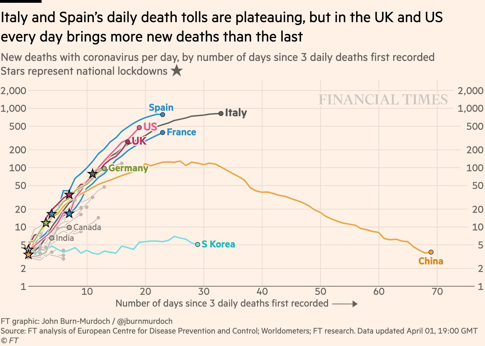
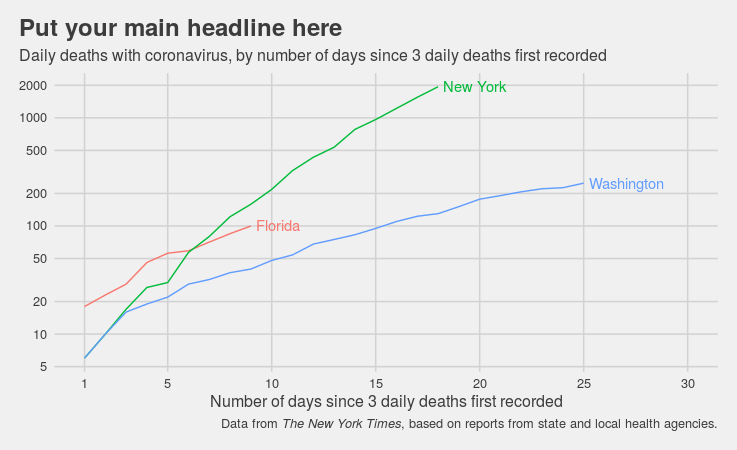
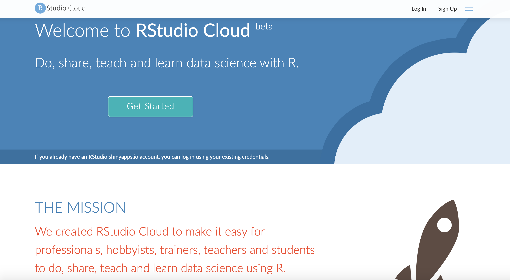

## {data-background="w01-cover.png"}

## Welcome

This workshop is for everyone. YMMV.

## About me

I'm a faculty member at Duke's Global Health Institute. **I'm not an epidemiologist.** My training is in clinical psychology, I teach courses on research methods, I study behavior change, and I dabble in data science.

## About you

## Goals

* To make you feel productive while obsessing over COVID-19 charts
* To get you using R
* To teach you enough about data science to know where to go next

## Not Goals

We'll reproduce interesting plots we find online as a way to motivate learning R and data science. Some of these plots will be wrong. **The goal is NOT to inform public debate about COVID-19.**

## Format

* Weekly live lesson via Zoom, Fridays at 9am ET
* Office hours Wednesdays at 9am ET
* Didactic bits with in-session coding practice
* Weekly challenge assignment (optional)

## Weekly Roadmap*

1. **Getting started with R and RStudio**
2. Getting to know `{ggplot2}`
3. Importing and transforming data
4. Exploratory data analysis
5. Interactive and animated plots
6. Relational data
7. Text mining
8. Flexdashboards (and shiny apps)
9. Tidymodels
10. Reproducible workflows

\*\ subject to change

## Today's plan

* Introduce you to R and RStudio
* Make our first plot
* Sell you on the concept of a reproducible workflow

## Today's plot inspiration

## Today's plot goal

  
## RStudio Cloud

## Getting set up

* Open a web browser and sign in to RStudio Cloud
* If you have an external monitor: 
  * Move your web browser window to your main monitor
  * Move the Zoom/video window to your secondary monitor
* If you have a second device like a tablet: 
  * Open your web browser on your computer
  * Connect to Zoom/video from your device
* **If you only have one screen, learn the keyboard shortcut to toggle between Zoom/video and your web broswer**
  * Mac: command + tab (plus means "and" not plus key)
  * Windows: Alt + Tab

## RStudio {data-background="#1f9ac9"}

