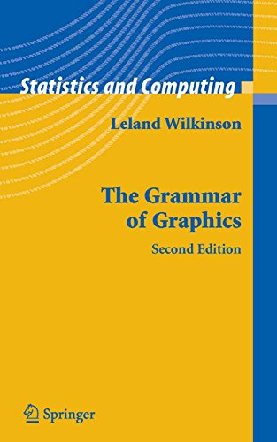

## {data-background="w02-cover.png"}

## Weekly Roadmap*

1. Getting started with R and RStudio
2. **Plotting with `{ggplot2}`**
3. Importing and transforming data
4. Exploratory data analysis
5. Interactive and animated plots
6. Relational data
7. Text mining
8. Flexdashboards (and shiny apps)
9. Tidymodels
10. Reproducible workflows

\*\ subject to change

## Today's plan

* Explain the idea behind the grammar of graphics
* Show you core ggplot2 functions
* RMarkdown goal: output to pdf

## Today's plot inspiration

## Today's plot goal

## The Grammar of Graphics

`{ggplot2}` implements the Leland Wilkinson's "grammar of graphics". Wickham (2010) describes the grammar of graphics as: 

"...a tool that enables us to concisely describe the components of a graphic. Such a grammar allows us to move beyond named graphics (e.g., the "scatterplot") and gain insight into the deep structure that underlies statistical graphics."

## The Grammar of Graphics

Source: Thomas Lin Pederson. Amazing workshop on `ggplot2`: https://github.com/thomasp85/ggplot2_workshop

## The Grammar of Graphics

Source: Thomas de Beus, https://tinyurl.com/sf8zude

## RStudio {data-background="#1f9ac9"}

## Wide format

