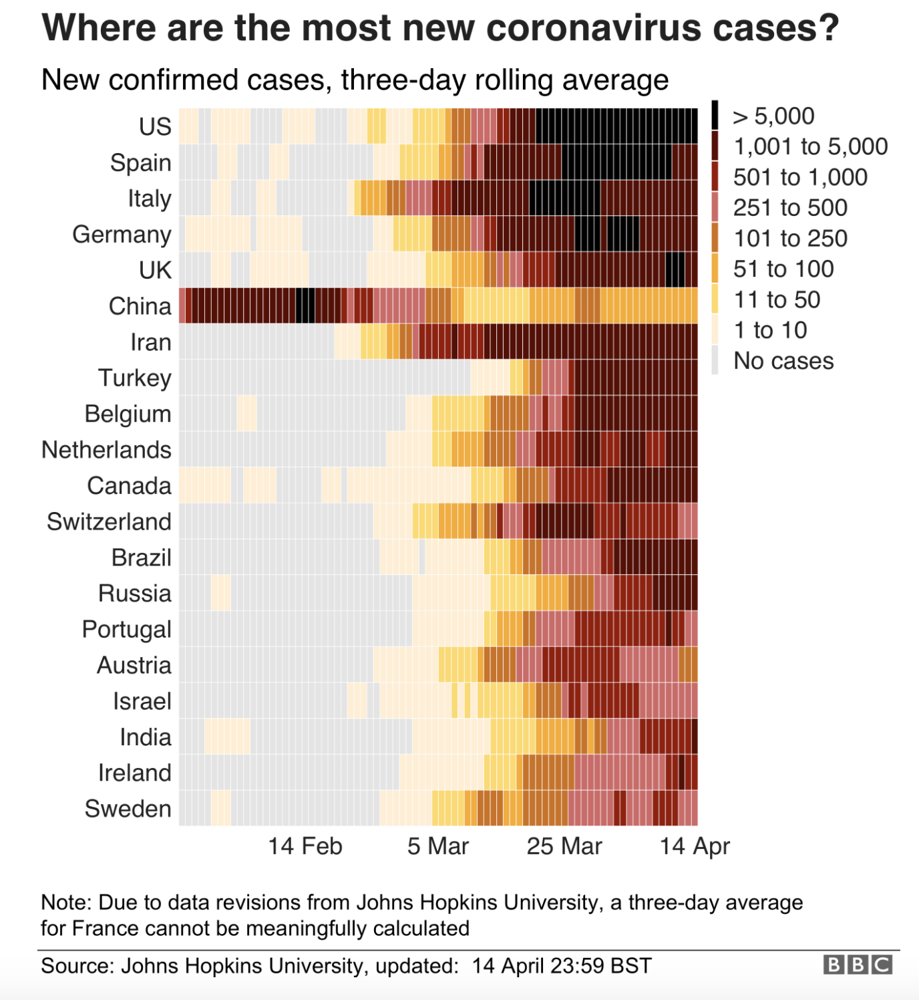
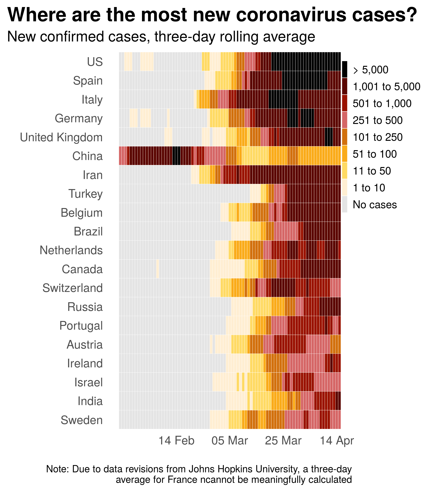
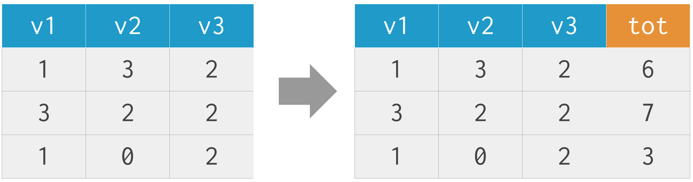
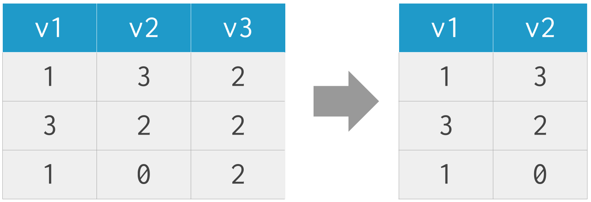
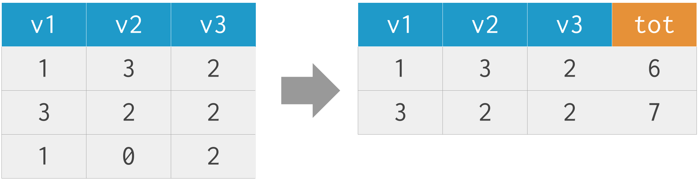
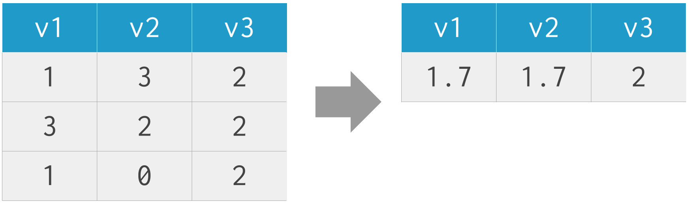
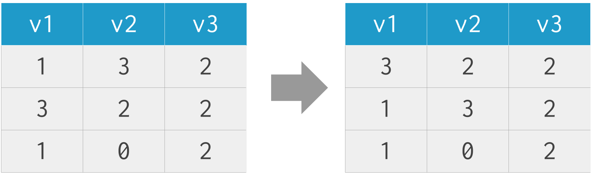
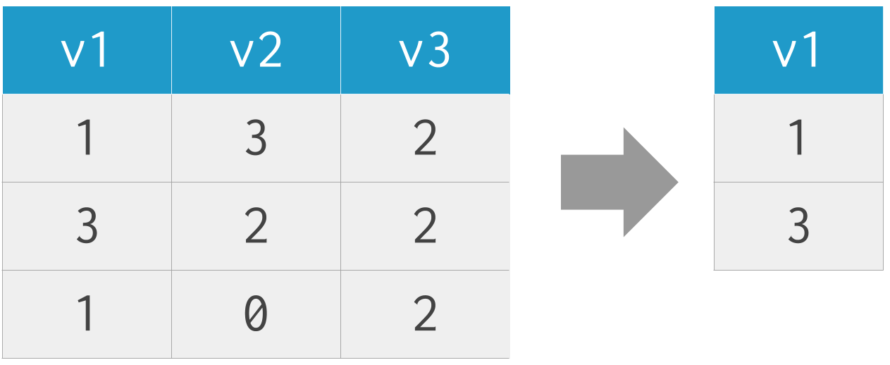

## {data-background="w03-cover.png"}

## Weekly Roadmap*

1. Getting started with R and RStudio
2. Plotting with `{ggplot2}`
3. **Importing and transforming data**
4. Exploratory data analysis
5. Interactive and animated plots
6. Mapping (will work in relational data)
7. Text mining
8. Flexdashboards (and shiny apps)
9. Tidymodels
10. Reproducible workflows

\*\ subject to change

## Today's plan

* Show several methods for importing data
* Demonstrate common `{dplyr}` functions for wrangling data
* RMarkdown goal: output to Tufte handout

## Today's plot inspiration

## Today's plot goal

## Importing data

* Local files
  * csv: `read.csv()`
  * RData: `load()`
  * Stata: `haven::read_dta()`
  * SPSS: `haven::read_sav()`
  * SAS: `haven::read_sas()`
* Web
  * csv: `read.csv(INSERT URL HERE)`
  * Google Sheets: `googlesheets4::read_sheet()`
  * APIs with `{httr}` and `{jsonlite}`
  * web scraping with `{rvest}`

## Tidy data

Last week we talked about how tidy data facilitates plotting. According to Hadley Wickham, RStudio's Chief Scientist and creator of many great packages like `{ggplot2}`, tidy data have three characteristics [@wickham:2014]:

1. Each variable forms a column.
2. Each observation forms a row.
3. Each type of observational unit forms a table.

## `dplyr`

https://dplyr.tidyverse.org/

## `dplyr::mutate()`

adds new variables that are functions of existing variables

## `dplyr::select()`

picks variables based on their names

## `dplyr::filter()`

picks cases based on their values

## `dplyr::summarize()`

reduces multiple values down to a single summary

## `dplyr::arrange()`

changes the ordering of the rows

## `dplyr::distinct()`

keeps unique rows

## RStudio {data-background="#1f9ac9"}

## References