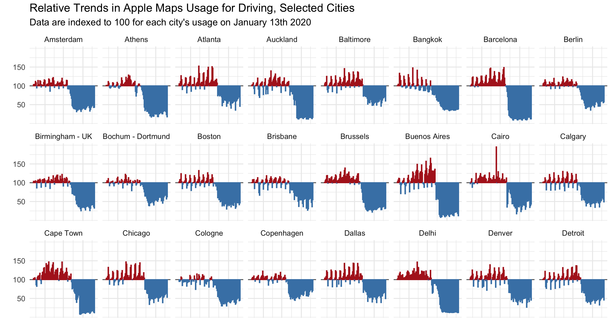
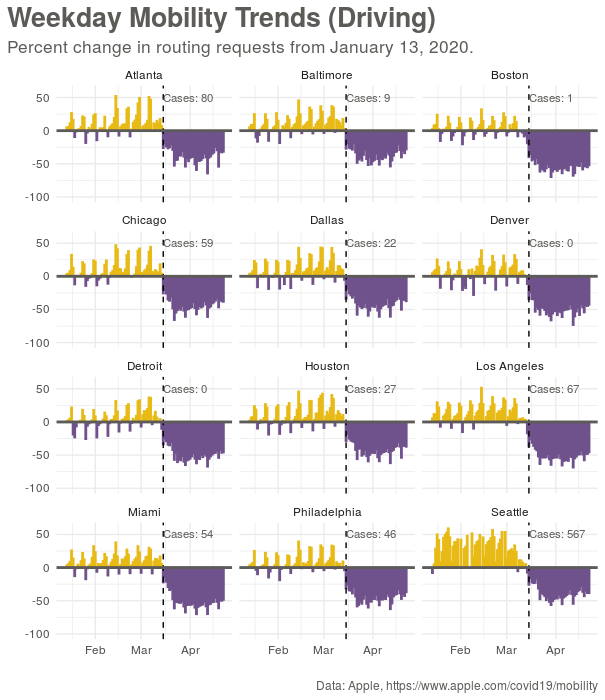
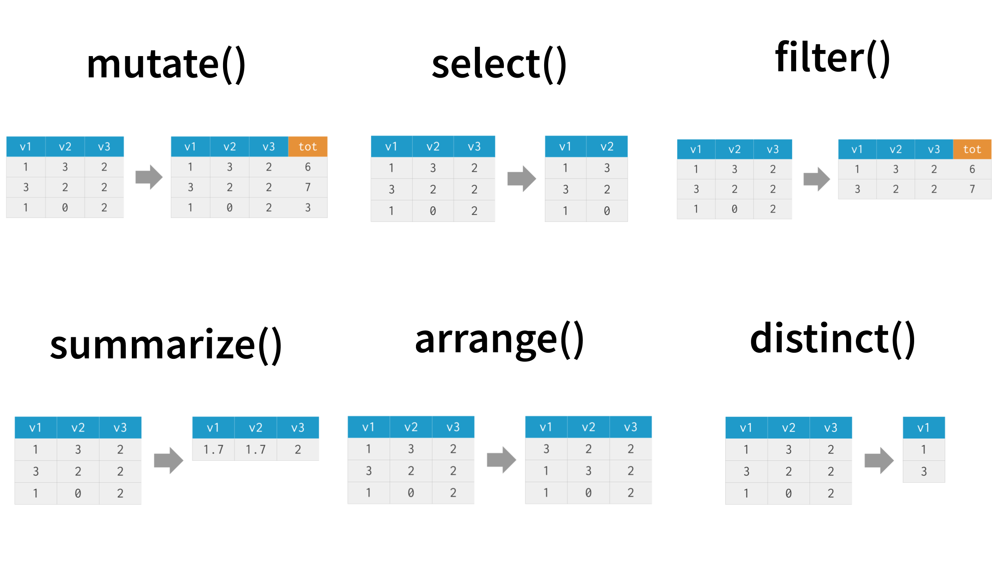
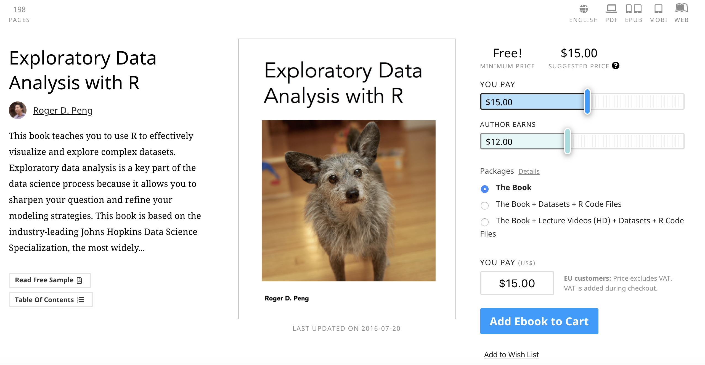
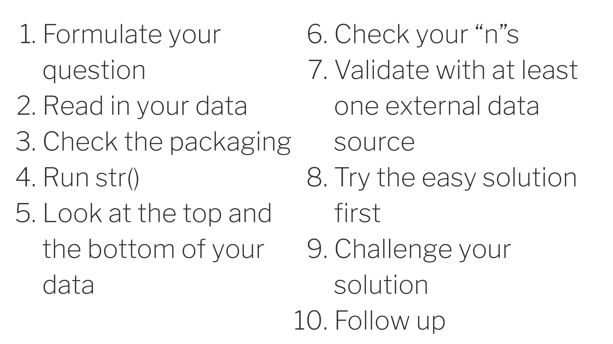

## {data-background="w04-cover.png"}

## Weekly Roadmap*

1. Getting started with R and RStudio
2. Plotting with `{ggplot2}`
3. Importing and transforming data
4. **Exploratory data analysis**
5. Interactive and animated plots
6. Mapping (will work in relational data)
7. Text mining
8. Flexdashboards (and shiny apps)
9. Tidymodels
10. Reproducible workflows

\*\ subject to change

## Today's plan

* Review tips for thinking about exploratory data analysis
* Learn some common first steps for summarizing and visualizing data while getting some practice with {`dplyr`}
* RMarkdown goal: output to APA-style manuscript with {`papaja`} package

## Today's plot inspiration

Kieran Healy, {`covdata`} package, https://kjhealy.github.io/covdata/

## Today's plot goal

## Last week: Importing Data

* Local files
  * csv: `read.csv()`
  * RData: `load()`
  * Stata: `haven::read_dta()`
  * SPSS: `haven::read_sav()`
  * SAS: `haven::read_sas()`
* Web
  * csv: `read.csv(INSERT URL HERE)`
  * Google Sheets: `googlesheets4::read_sheet()`
  * APIs with `{httr}` and `{jsonlite}`
  * web scraping with `{rvest}`

## Last week: `dplyr`

https://dplyr.tidyverse.org/

## Exploratory Data Analysis

https://leanpub.com/exdata

## Peng's EDA Checklist

Roger Peng, https://tinyurl.com/y833jdgv

## Tidy Tuesday Videos

<iframe width="889" height="500" src="https://www.youtube.com/embed/-5HYdBq_PTM" frameborder="0" allow="accelerometer; autoplay; encrypted-media; gyroscope; picture-in-picture" allowfullscreen></iframe>

David Robinson, https://youtu.be/-5HYdBq_PTM

## RStudio {data-background="#1f9ac9"}

## References