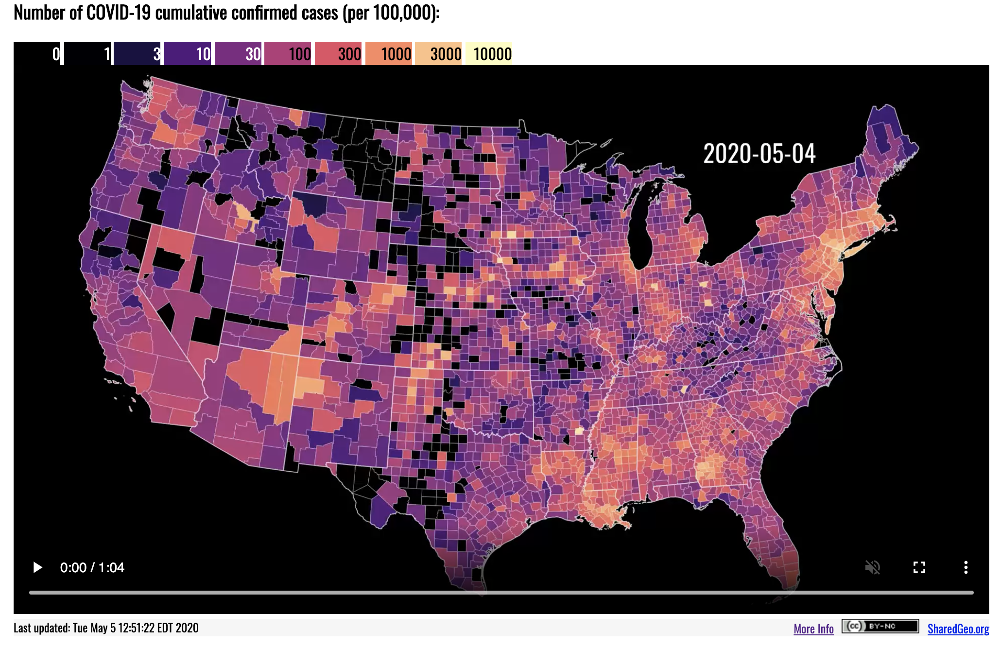
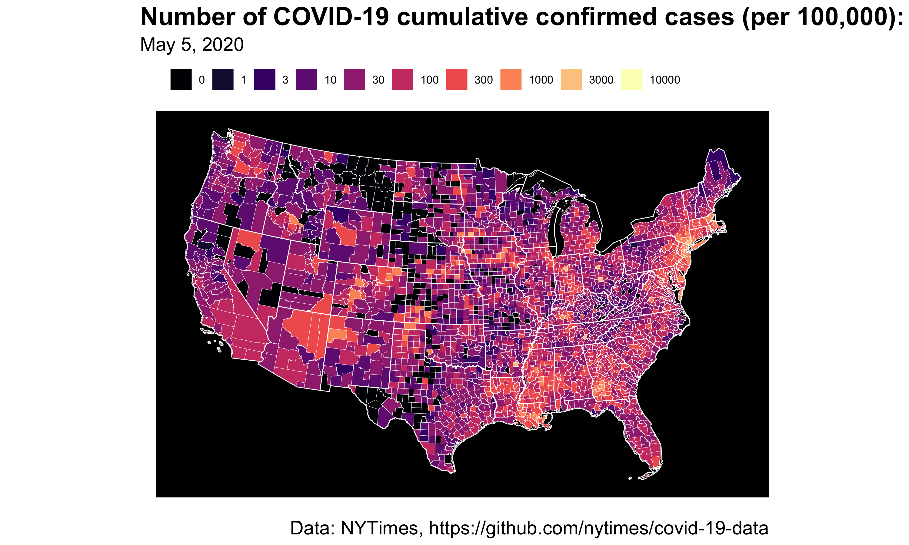
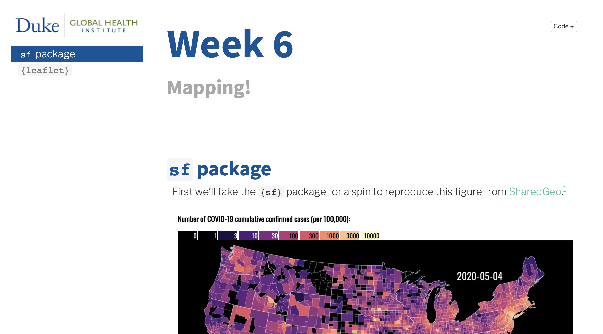
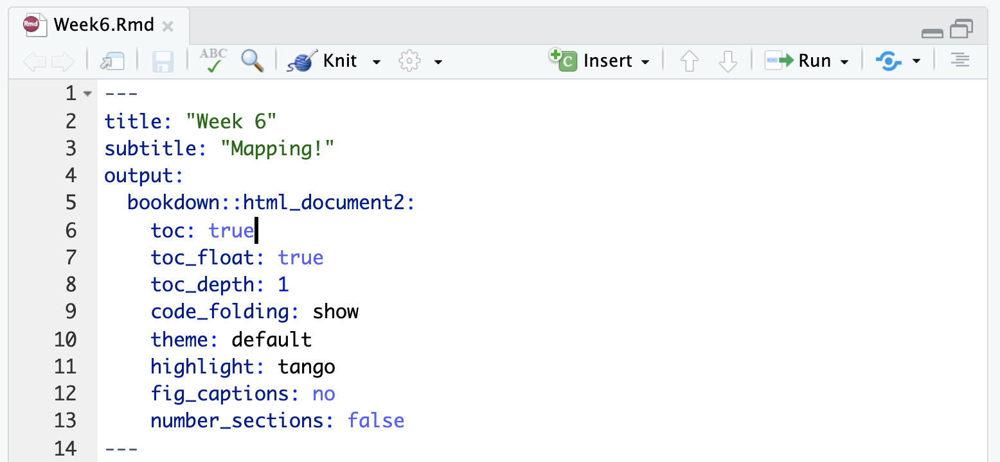
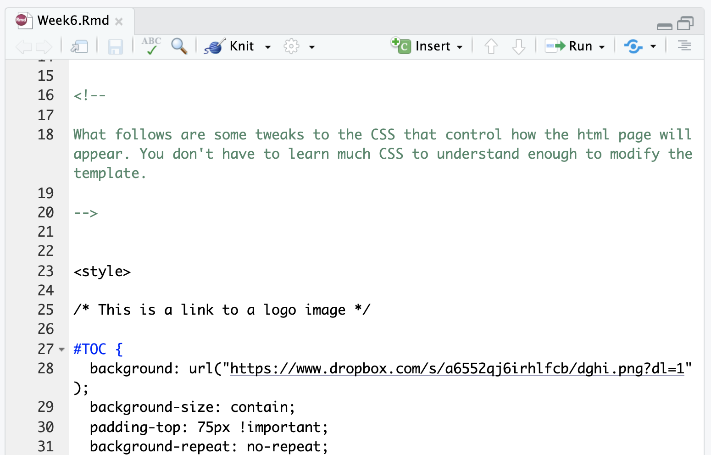

```{r xaringan-themer, include=FALSE, warning=FALSE}
library(xaringanthemer)
style_mono_accent(
  base_color = "#1f9ac9",
  header_font_google = google_font("Source Sans Pro"),
  text_font_google   = google_font("Libre Franklin", "300", "300i"),
  code_font_google   = google_font("Anonymous Pro")
)
```

```{r setup, include = F}
# This is the recommended set up for flipbooks
# you might think about setting cache to TRUE as you gain practice --- building flipbooks from scracth can be time consuming
knitr::opts_chunk$set(fig.width = 6, message = FALSE, warning = FALSE, comment = "", cache = TRUE, fig.retina = 3)
library(flipbookr)
library(tidyverse)
options(tibble.print_min=25)
```

<style type="text/css">
.title-slide {
  background-image: url(w06-cover.png);
  background-size: cover;
}
.title-slide .remark-slide-number {
  display: none;
}
.title-slide h1 {
  text-shadow: none;
  color: #FFF;
  margin-top: -70px;
}
.remark-slide-content {
    font-size: 30px;
    padding: 1em 4em 1em 4em;
}
</style>

 
# Weekly Roadmap*

1. Getting started with R and RStudio
2. Plotting with `{ggplot2}`
3. Importing and transforming data
4. Exploratory data analysis
5. Interactive and animated plots
6. <span style="color:#1f9ac9;">**Mapping**</span>
7. Text mining
8. Flexdashboards (and shiny apps)
9. Tidymodels
10. Reproducible workflows

<span style="color:#1f9ac9;font-size: 70%;">* subject to change</span>

---

# Today's Plan

* Merge health data with simple features geometry and plot
* Create leaflet map
* RMarkdown goal: styled html report

---

# Today's Plot Inspiration

<center>

</center>

<span style="color:#1f9ac9;font-size: 70%;">Source: SharedGeo, https://www.sharedgeo.org/COVID-19/</span>

---

# Today's Plot Goal 

<center>

</center>

---

# Today's Rmarkdown Goal

<center>

</center>

---

# YAML

<center>

</center>

<span style="color:#1f9ac9;font-size: 70%;">Learn more at https://bookdown.org/yihui/rmarkdown/html-document.html</span>

---

# A Spoonful of CSS

<center>

</center>

---

# Packages

Jump down to the `packages` chunk around line 190 and load the packages we need for today.

```{r packages}
library(tidyverse)
library(sf)
library(viridis)
library(lubridate)
library(leaflet)
```

---

# Get the Data

We have two data sources: county-level COVID-19 data from the NY Times and county population and geographic data from the U.S. Census Bureau. Let's start by grabbing the county-level COVID-19 data.

```{r load}
covid <- read.csv("https://raw.githubusercontent.com/nytimes/covid-19-data/master/us-counties.csv", 
                  stringsAsFactors = FALSE) %>%
  tibble()
```

<span style="color:#1f9ac9;font-size: 70%;">`tibble()` is only needed for this `flipbookr` presentation. Without it the deck won't compile because the `covid` dataset is too large. `tibble()` modifies what gets printed to the slide.</span>
---

# Get the Boundaries

Getting U.S. population data is simple with the `{tidycensus}` package. To get the data you have to register for an API key at https://api.census.gov/data/key_signup.html.

```
# library(tidycensus)
# https://api.census.gov/data/key_signup.html
# census_api_key("YOUR KEY HERE")

# counties <- get_acs(geography = "county",
#                     variables = "B01003_001",
#                     geometry = TRUE) 
# 
# states <- get_acs(geography = "state",
#                   variables = "B01003_001",
#                   geometry = TRUE)
```

```{r gis, include=FALSE}
load("../assignments/week 6/census.RData")
```

---

# Prep COVID Data

.pull-left[
The original plot only shows the lower 48 states, so we have to exclude Alaska, Hawaii, DC, and Puerto Rico from the COVID data and from the boundary files. With the COVID data we also need to standarize the county codes (`fips`) to have 5 digits by adding a leading zero when the code only has 4 digits (e.g., 6059 becomes 06059).
]

.pull-right[

```{r prepShow, include=TRUE, eval=FALSE}
covid %>% 
  filter(state!="District of Columbia" & 
         state!="Puerto Rico" & 
         state!="Hawaii" & 
         state!="Alaska") %>% 
  select(date, fips, cases, deaths) %>% 
  mutate(date = lubridate::ymd(date)) %>% 
  mutate(fips = stringr::str_pad(fips, width=5, 
                                 pad="0")) ->
  covidPrepped
```
]

```{r prep, include=FALSE}
covid %>% 
  filter(state!="District of Columbia" & 
         state!="Puerto Rico" & 
         state!="Hawaii" & 
         state!="Alaska") %>% 
  select(date, fips, cases, deaths) %>% 
  mutate(date = lubridate::ymd(date)) %>% 
  mutate(fips = stringr::str_pad(fips, width=5, 
                                 pad="0")) ->
  covidPrepped
```
---

`r chunk_reveal("prep", break_type = "auto")`

---

# Prep geographic data

.pull-left[
We'll use two types of boundary files: `states` for state outlines and `counties` to fill with COVID data.
]

.pull-right[
```{r geoShow, include=TRUE, results='hide'}
  counties %>%
    filter(!grepl("Hawaii", NAME)) %>%
    filter(!grepl("Puerto Rico", NAME)) %>%
    filter(!grepl("District of Columbia", NAME)) %>%
    filter(!grepl("Alaska", NAME)) ->
    counties
  
  states %>%
    filter(NAME!="District of Columbia" &
           NAME!="Puerto Rico" &
           NAME!="Hawaii" &
           NAME!="Alaska") ->
    states
```
]

---

```{r, geoPrep, include=FALSE}
  counties %>%
    tibble() %>% select(GEOID, NAME) %>%
    filter(GEOID %in% c("01041", "15001", "20177", "15007")) ->
    grepl_example
```

```{r geo, include=FALSE}
  grepl_example
  grepl("Hawaii", grepl_example$NAME)
  !grepl("Hawaii", grepl_example$NAME)
```

---

`r chunk_reveal("geo", break_type = "auto")`

---

# Join the COVID Data

```{r joinPrep, include=FALSE}
  counties %>%
    left_join(covidPrepped, by = c("GEOID" = "fips")) ->
    joined
```

```{r join, include=FALSE}
  counties %>% tibble() %>%
    select(GEOID, NAME) %>%
    left_join(select(covidPrepped, fips, cases), 
              by = c("GEOID" = "fips")) %>%
    group_by(GEOID) %>% count()
```

---

`r chunk_reveal("join", break_type = "auto")`

---

# Fill in missing days with 0

We need every county to have an entry for every date, so we'll use the `complete()` function and fill in 0 for cases for all missing dates.

```{r complete, include=FALSE}
  joined %>%
    complete(GEOID, date, fill = list(cases = 0)) %>%
    select(GEOID, date, cases) ->
    completed

  completed %>% tibble() %>%
    group_by(GEOID) %>% count()
```

---

`r chunk_reveal("complete", break_type = "auto")`

---

# Rejoin and normalize

.pull-left[
Now we can re-join our `completed` data to the full geographic data in `counties` and construct several variables, including the normalized case value.
]

.pull-right[
```{r rejoin, include=TRUE}
  completed %>%
    left_join(select(counties, GEOID, NAME, estimate, 
                     geometry),
              by = "GEOID") %>%
    st_as_sf() ->
    rejoined
```
]
---

`r chunk_reveal("rejoin", break_type = "auto")`

---

# Construct

.pull-left[
Now we can re-join our `completed` data to the full geographic data in `counties` and construct several variables, including the normalized case value.
]

.pull-right[
```{r constructShow, include=TRUE}
  rejoined %>%
    mutate(casesPop = ifelse(is.na(cases), 0, cases)) %>%
    mutate(casesPop = (cases/estimate)*100000) %>%
    mutate(group = cut(casesPop, 
                       breaks = c(0, 1, 3, 10, 30, 100, 
                                  300, 1000, 3000, 10000, 
                                  Inf),
                       labels = c(0, 1, 3, 10, 30, 100, 
                                  300, 1000, 3000, 10000),
                       include.lowest = TRUE)
    ) %>%
    mutate(month = lubridate::month(date, 
                                    label=TRUE, 
                                    abbr=TRUE),
           day = lubridate::day(date),
           monthDay = paste(month, day, sep=" "),
           dayLabel = lubridate::wday(date)) %>%
    filter(dayLabel==3) %>%
    select(monthDay, GEOID, geometry, group) ->
    constructed
```
]
---

```{r construct, include=FALSE}
  rejoined %>% tibble() %>% select(GEOID, date, cases, estimate) %>%
   arrange(desc(cases)) %>%
    mutate(casesPop = (cases/estimate)*100000) %>%
    mutate(group = cut(casesPop, 
                       breaks = c(0, 1, 3, 10, 30, 100, 
                                  300, 1000, 3000, 10000, 
                                  Inf),
                       labels = c(0, 1, 3, 10, 30, 100, 
                                  300, 1000, 3000, 10000),
                       include.lowest = TRUE)
    ) %>%
    mutate(month = lubridate::month(date, 
                                    label=TRUE, 
                                    abbr=TRUE)) %>%
    mutate(day = lubridate::day(date)) %>%
    mutate(monthDay = paste(month, day, sep=" ")) %>%
    mutate(dayLabel = lubridate::wday(date)) %>%
    filter(dayLabel==3) 
```

`r chunk_reveal("construct", break_type = "auto")`

---

# Plot

```{r plot, include=FALSE}
  ggplot(constructed %>% filter(monthDay=="May 5")) +
      geom_sf(aes(fill = group), color = "white", size=.1) +
      geom_sf(data=states, fill=NA, color="white", size=.3) +
      scale_fill_viridis_d(option = "magma", drop=FALSE) +
      labs(title = "Number of COVID-19 cumulative\nconfirmed cases (per 100,000):",
           subtitle = 'May 5, 2020',
           caption = "Data: NYTimes, https://github.com/nytimes/covid-19-data",
           x="",
           y="") +
      coord_sf(crs = "+proj=aea +lat_1=29.5 +lat_2=45.5 +lat_0=37.5 +lon_0=-96 +x_0=0 +y_0=0 +ellps=GRS80", 
               datum=NA) +
      theme_minimal() + 
      theme(panel.background = element_rect(fill = 'black'),
            plot.title.position = "plot",
            plot.title = element_text(size=20,
                                      face="bold"),
            plot.subtitle = element_text(size=15),
            plot.caption = element_text(size=10),
            legend.position = "top",
            legend.box = "horizontal",
            legend.title = element_blank(),
            legend.justification='left') +
      guides(fill = guide_legend(nrow = 1))
```

---

`r chunk_reveal("plot", break_type = "auto")`

---

# Leaflet

`{[leaflet](https://rstudio.github.io/leaflet/)}` is a simple to use yet powerful library for creating interactive maps. We're going to finish with a simple example that uses `{leaflet}` to overlay our `sf` object on an interactive map.

```{r leafPrep, include=FALSE}
  constructed %>%
    filter(substring(GEOID, 1, 2)=="37") %>%
    filter(monthDay=="May 5") %>%
    mutate(group = as.numeric(as.character(as.factor(group)))) ->
    nc
  
  c(0, 1, 3, 10, 30, 100, 300, 
    1000, 3000, 10000, Inf) -> bins
  colorBin("YlOrRd", domain = nc$group, 
           bins = bins) -> pal
```


```{r leaf, include=FALSE, warning=FALSE, message=FALSE}
  nc %>%
    leaflet() %>% 
    setView(lng = -78.8986, lat = 35.9940, zoom = 6) %>% 
    addProviderTiles(providers$CartoDB.Positron) %>%
    addPolygons(fillColor = ~pal(group),
                weight = .5,
                opacity = .7,
                color = "white") %>%
    addLegend(pal = pal, 
              values = ~group, 
              opacity = 0.7, 
              title = NULL,
              position = "bottomright")
```

---

`r chunk_reveal("leaf", break_type = "auto")`

---


```{css, eval = TRUE, echo = FALSE}
.remark-code{line-height: 1.5; font-size: 50%}
```
