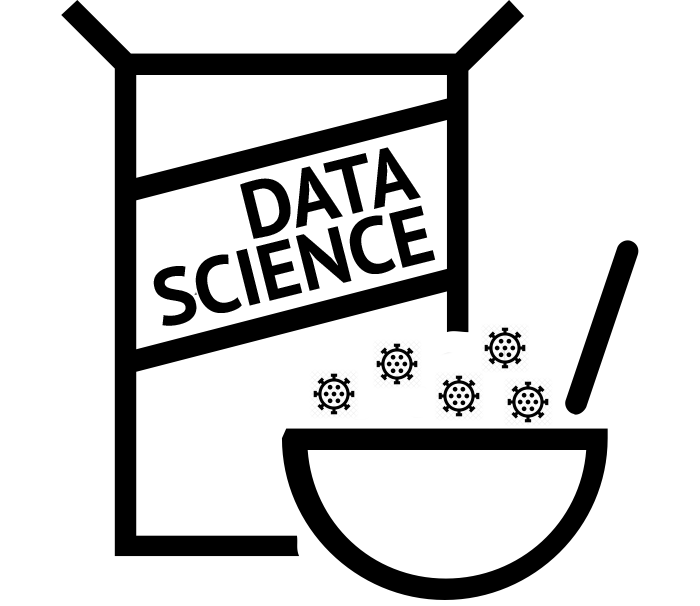

```{r, echo=FALSE, out.width = "50%"}
library(knitr)

```

Spring, 2020

Who's got two thumbs and loves data science? *These guys*!

Lots of other people have thumbs and love data science, too. These people have made dozens of free and paid courses that will help you build core skills in a matter of weeks. So why design another course?

The reason is simple. We find that our students struggle to find the time and energy, on top of all other demands, to make it through these on-line courses on their own. So we thought, what if we designed a live workshop for these students and scheduled it for 7:15am? We could promise them strong coffee and food. Dangle the possibility of a free t-shirt and knowledge.

Could it work?

Who knows?! We're making this up as we go. But we have a roadmap (look behind us in the photo).

Our objective is to teach you the fundamental skills you need to go from raw data to a manuscript or presentation. Two important caveats:

1. This is not a course about data collection. 
2. This is not a course about data analysis, per se.

Most stats classes teach you how to run a regression, so we won't. Instead, we'll focus on what these courses often skip over (for good reason): everything you need to do with your data before hitting run, as well as the steps that get you from output to tables, figures, and text. We'll teach you everything we know about reproducible analysis and good practices for setting up reproducible data analysis pipelines. In doing so, we'll lean on some great resources, including [*R for Data Science*](http://r4ds.had.co.nz/) and [*Data Visualization for Social Science*](https://kieranhealy.org/publications/dataviz/).

There is no homework, nothing to prepare. Just roll out of bed and bring a charged laptop. You can also bring your own data, but we won't have time in session to help you. A better plan is to complete the demos in session and then practice on your own data later.

* * * 

Landing page image credit: Cereal by [Chris Markhing from the Noun Project](https://thenounproject.com/search/?q=cereal%20bowl&i=195379)