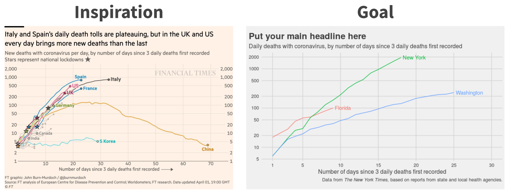

<br>

In this session I'll introduce you to R and RStudio. We'll make our first plot, and I'll demonstrate how you can share this plot in a reproducible workflow.

```{r, echo=FALSE, out.width = "100%"}
library(knitr)

```


<center>

[Deck](decks/w01-deck.html) | [Run locally]("https://github.com/ericpgreen/ieat-covid2020/blob/master/assignments/wk01.Rmd") | [Run in RStudio Cloud](https://rstudio.cloud/spaces/58787/join?access_code=OjiTdrJW4vnSj64sECi3NsIQw1Dwdvow0JHK7KJW)

<br>

<iframe width="800" height="450" src="https://www.youtube.com/embed/fntu_jMsWWE" frameborder="0" allow="accelerometer; autoplay; encrypted-media; gyroscope; picture-in-picture" allowfullscreen></iframe>
</center>

