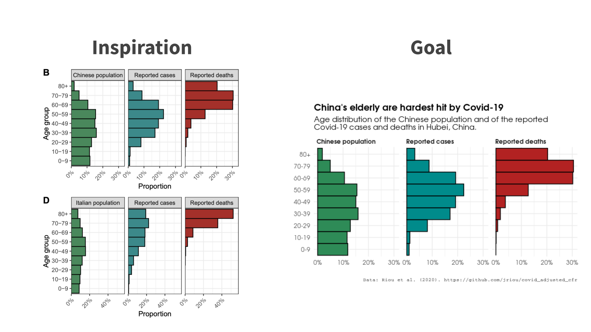

<br>

In this session I'll teach you about the grammar of graphics and get you going with ggplot2.

```{r, echo=FALSE, out.width = "100%"}
library(knitr)

```


<center>

[Deck](decks/w02_deck.html) | [Run locally](https://github.com/ericpgreen/ieat-covid2020/blob/master/assignments/wk02.Rmd) | [Run in RStudio Cloud](https://rstudio.cloud/spaces/58787/join?access_code=OjiTdrJW4vnSj64sECi3NsIQw1Dwdvow0JHK7KJW)

<br>

[video to be posted]

<br>

## Weekly Post-Session Challenge

[check back!]