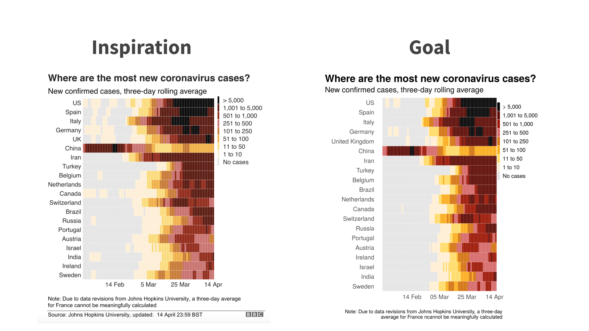

<br>

In this session I'll teach you how to get data into R and how to wrangle it until it does what you want.

```{r, echo=FALSE, out.width = "100%"}
library(knitr)

```


<center>

[Deck](decks/w03_deck.html) | [Run locally]() | [Run in RStudio Cloud](https://rstudio.cloud/spaces/58787/join?access_code=OjiTdrJW4vnSj64sECi3NsIQw1Dwdvow0JHK7KJW)

<br>

Check back!

</center>

<br>

## Weekly Post-Session Challenge

Check back!