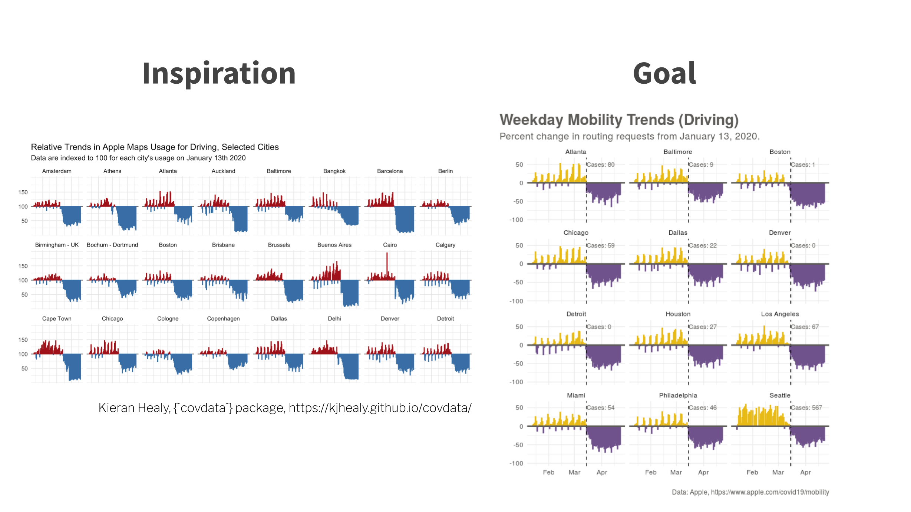

<br>

In this session I'll introduce you to the art of exploring your data in R.

```{r, echo=FALSE, out.width = "100%"}
library(knitr)

```


<center>

[Deck](decks/w04_deck.html) | [Run locally](https://raw.githubusercontent.com/ericpgreen/ieat-covid2020/master/assignments/wk04.Rmd) | [Run in RStudio Cloud](https://rstudio.cloud/spaces/58787/join?access_code=OjiTdrJW4vnSj64sECi3NsIQw1Dwdvow0JHK7KJW)
</center>
<br>

<iframe width="800" height="450" src="https://www.youtube.com/embed/okf8pg8MoQQ" frameborder="0" allow="accelerometer; autoplay; encrypted-media; gyroscope; picture-in-picture" allowfullscreen></iframe>

<br>

## Weekly Post-Session Challenge

This week's challenge is to swap deaths for cases (I left some breadcrumbs in the .Rmd), swap transit for driving, limit to weekdays, and change the colors.