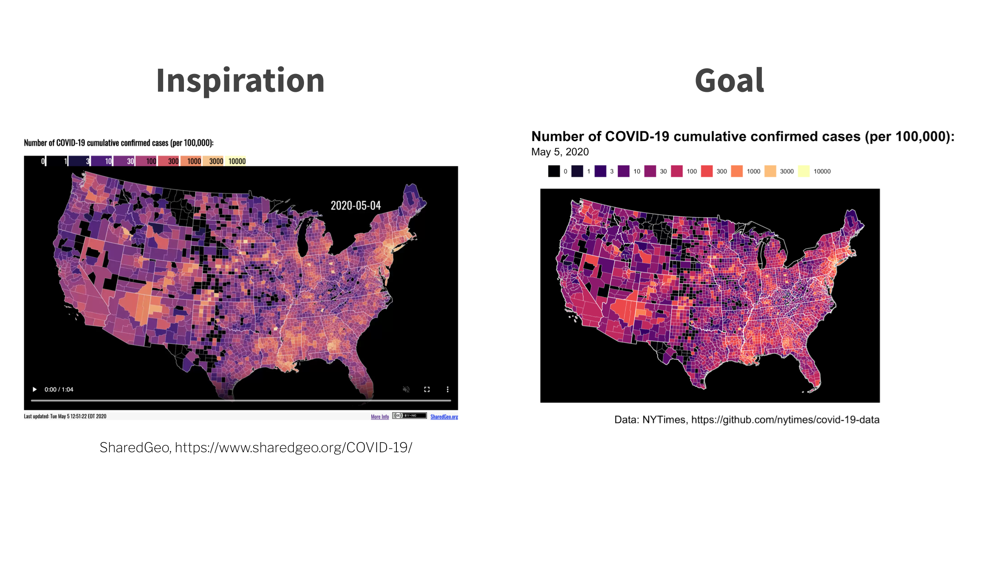

<br>

In this session I'll introduce you to mapping in R with `{sf}` and `{leaflet}`.

```{r, echo=FALSE, out.width = "100%"}
library(knitr)

```


<center>

[Deck](decks/w06_deck.html) | [Run locally]() | [Run in RStudio Cloud](https://rstudio.cloud/spaces/58787/join?access_code=OjiTdrJW4vnSj64sECi3NsIQw1Dwdvow0JHK7KJW)
</center>
<br>

<iframe width="800" height="450" src="https://www.youtube.com/embed/_99H5rc-Z68" frameborder="0" allow="accelerometer; autoplay; encrypted-media; gyroscope; picture-in-picture" allowfullscreen></iframe>

<br>

## Weekly Post-Session Challenge

Try making a `{ggplot2}` chloropleth map of state-level population-adjusted deaths for May 5, 2020.