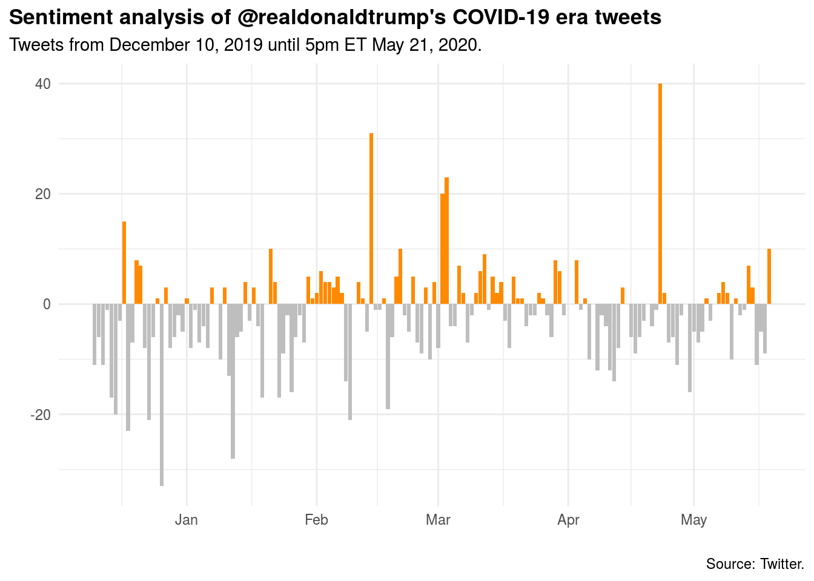

<br>

We're in the age of big data, and text mining has never been more popular or easier to do, especially in R. Whether you are a qualitative researcher looking to automate more of your workflow or a quant seeking to pull insights from a corpus of messages, text mining is a skill you need. In this session I'll introduce you to text mining in R with `{tidytext}`.

```{r, echo=FALSE, out.width = "100%"}
library(knitr)

```


<center>

No Deck | [Run locally](https://github.com/ericpgreen/ieat-covid2020/blob/master/assignments/wk07.Rmd) | [Run in RStudio Cloud](https://rstudio.cloud/spaces/58787/join?access_code=OjiTdrJW4vnSj64sECi3NsIQw1Dwdvow0JHK7KJW)
</center>
<br>

<iframe width="800" height="450" src="https://www.youtube.com/embed/9uHEgTOyVEs" frameborder="0" allow="accelerometer; autoplay; encrypted-media; gyroscope; picture-in-picture" allowfullscreen></iframe>

<br>

## Weekly Post-Session Challenge

Find a new corpus of COVID-related text and conduct a sentiment analysis. You could explore twitter data or create your own text corpus.