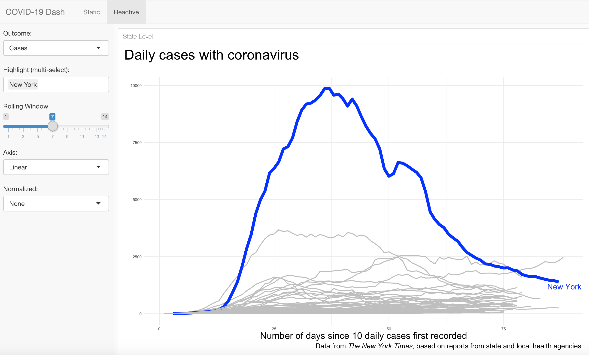

<br>

In this session I'll introduce you to creating easy dashboard layouts with Flexdashboard and show how to incorporate a bit of Shiny magic.

```{r, echo=FALSE, out.width = "100%"}
library(knitr)

```


<center>

No Deck | [Run locally](https://github.com/ericpgreen/ieat-covid2020/blob/master/assignments/wk08.Rmd) | [Run in RStudio Cloud](https://rstudio.cloud/spaces/58787/join?access_code=OjiTdrJW4vnSj64sECi3NsIQw1Dwdvow0JHK7KJW)
</center>
<br>

No video yet (technical problems)
<br>

## Weekly Post-Session Challenge

Create your own dashboard of COVID-19 data with at least two reactive inputs.